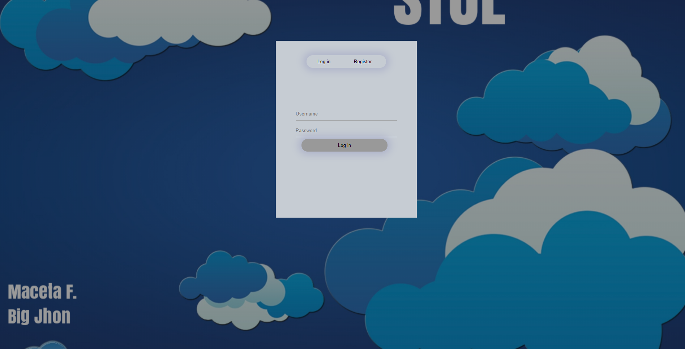
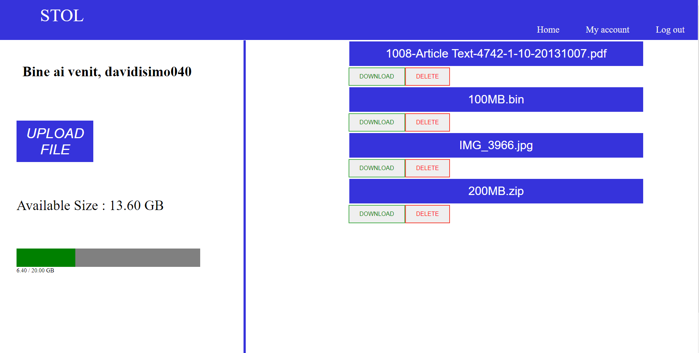
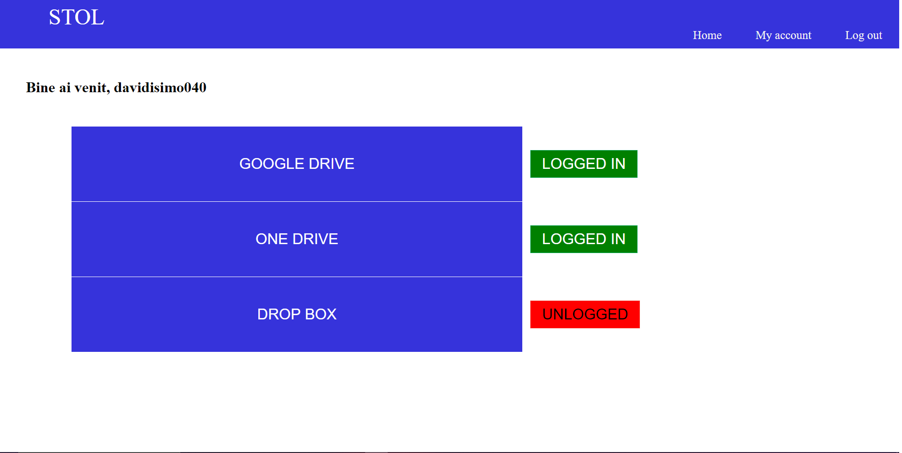

# Stol (Universal Online Storage Tool)

Stol  is an Universal Online Storage Tool written in Vanilla Node.js (for backend), HTML\CSS (for frontend)  and MongoDB (for databases) that integrates the three biggest storage tools APIs (Google Drive, Microsoft OneDrive and Dropbox) in a single application. When a user uploads a large file, it is split into multiple parts and uploaded to each of the storage tools linked to the account. The when downloading the uploaded file, the app assures safe file recomposition.

## Run the server yourself

This server can be run using the basic command for running a Node.js server

```bash
node index.js
```

## App photos

▪ The Login Page:



▪The Home Page:



▪ How to link your account to online storage tools:




## Contributing
Pull requests are welcome. For major changes, please open an issue first to discuss what you would like to change.

Please make sure updates are appropriate.
